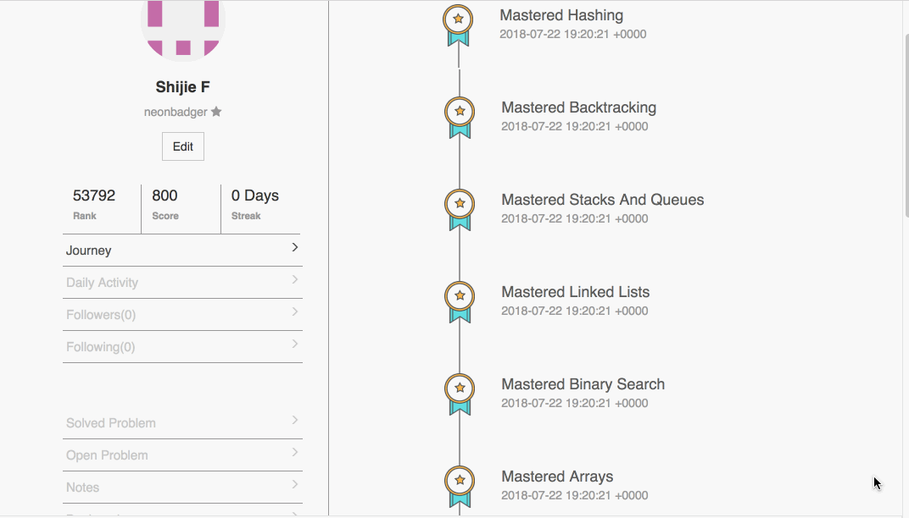

# Prework

Completed checkpoints:

1. [Pretty Print](pretty_print.py)
2. [Kth Smallest Element in the Array](kth_smallest_element.py)
3. [Next Greater](next_greater.py)
4. [Longest Consecutive Sequence](longest_consecutive_sequence.py)

